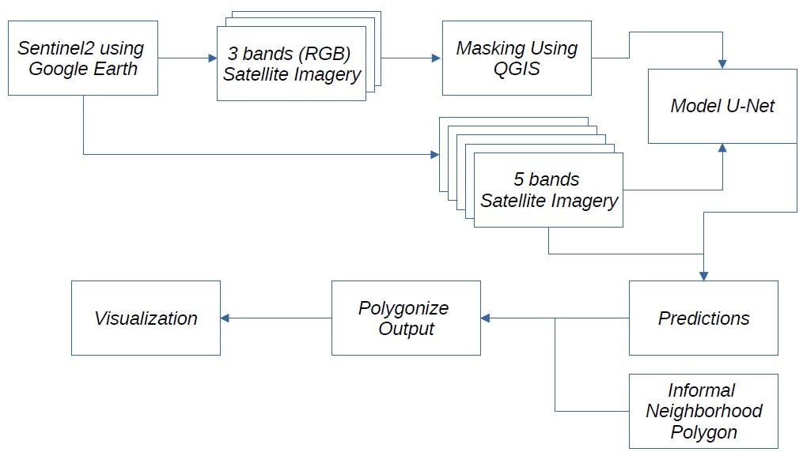

# Builded Detection with Satellite Imagery (BDSI)

Project Flowchart

This project consist in 4 repositories:

## The fine-tuning of the model UNet:

https://github.com/lucasenrich/BDSI_fine_tune_UNet_landuse

+ Objective of Respository: Train a model.
+ Contents: A Jupyter notebook with code to train the model.
+ Input: _.geojson_ file with mask (manually selected polygon using QGIS software)
+ Output: A _.h5_ model fine-tunned

## An API builded with FAST-API (python)

https://github.com/lucasenrich/BDSI_apiPred

+ Objective of Respository: 
	Extract Sattelite Images from Sentinel-2 (parameters allow True Color Images (TCI) and 5 bands =[B4,B3,B2,B8,B11])
	Use the model to predict and get a raster image with the results.

+ Contents:
	
 + Previously trained model
 + Code with ETL from Google-Earth API
 + Code with ETL to get the predictions from images previously extracted
 + _.geojson_ file with polygons from informal neighborhood to get the boundries (extent and perimeters)

+ Input: 

	+ API parameters:
		+ ID of informal neighborhood to extrac
		+ TCI: False/True. If True, it extract only RGB images
		+ Predict: False/True. If True, gets prediction, if False not. The model only accepts 5 bands, so if TCI is True, it cannot process the predictions.
		+ Anio: Year which is required to predict. Minimum available from google-earth is 2019.

## An API builded with Plumber (R)

https://github.com/lucasenrich/BDSI_apiR
		
+ Objective of Respository: Polygonize output from previous process. Given that the output of the previous process is a raster file and that R has a simpler way to polygonize the perimters.
+ Contents: Code to build the API to polygonize
+ Input: ID to polygonize
+ Output: ".geojson" with perimeters predicted

## Streamlit application (Python) to process and visualize all previous project

https://github.com/lucasenrich/BDSI_vizapp

## Pending (TO-DO)

Future work is about:

+ Database management (PostGIS)
+ Dockerize

